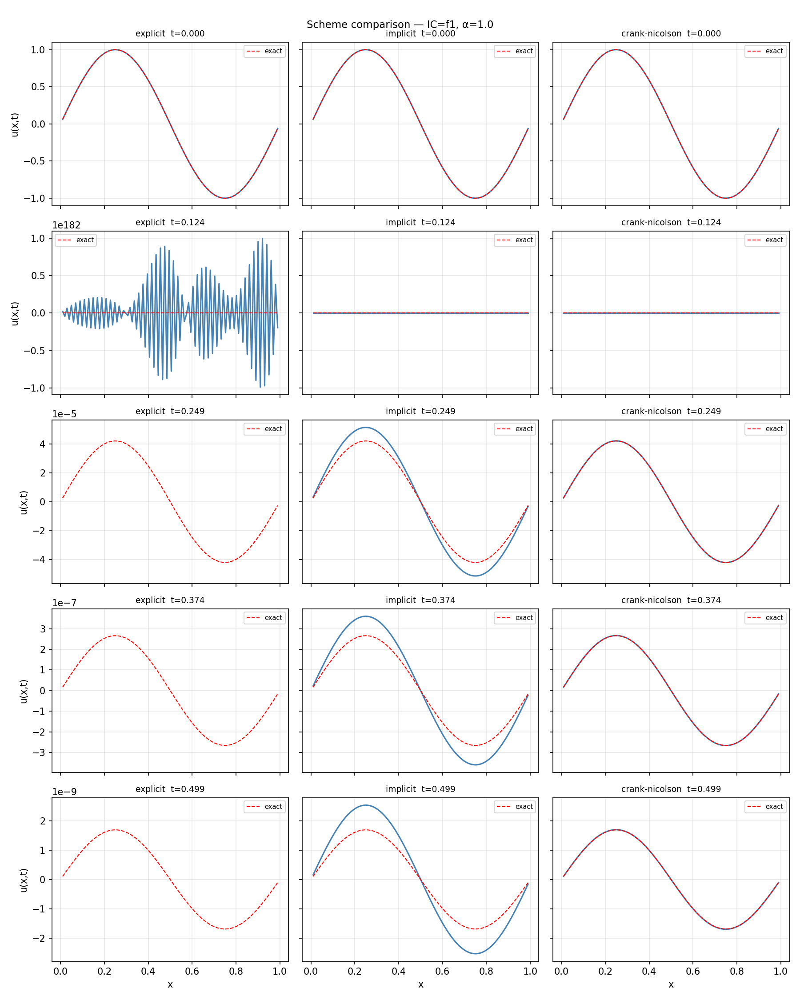
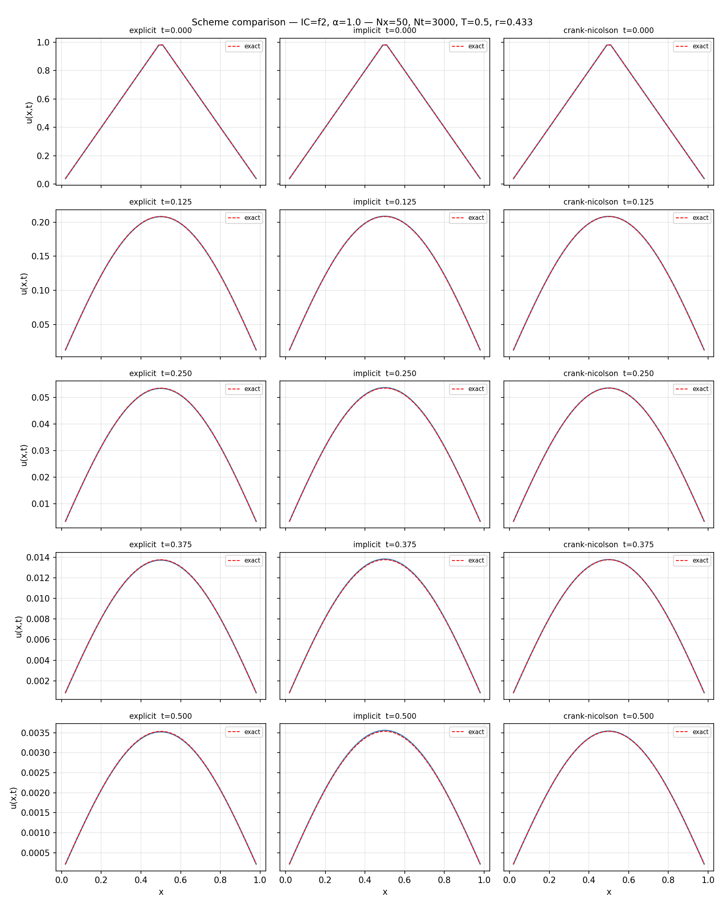
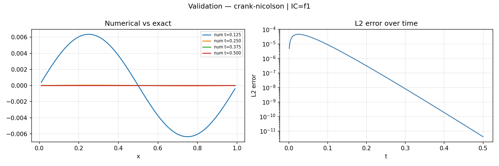
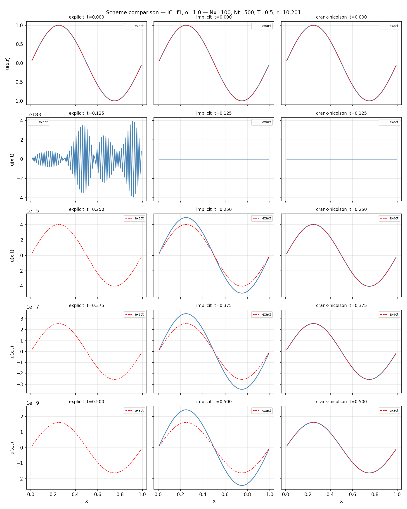

# Numerical Solution of a Reaction-Diffusion PDE: Design, Analysis, and Results

**Course:** TP TM — Numerical Methods for PDEs  
**Authors:** SHI Jianye & WEI Wei  
**Date:** April 2026  
**Language:** Python 3 / NumPy

---

## Table of Contents

| Section | Title | Page |
|---------|-------|------|
| — | Abstract | 3 |
| 1 | Problem Formulation | 3 |
| 1.1 | Governing Equation | 3 |
| 1.2 | Exact Solution for f1 | 4 |
| 1.3 | Behaviour for f2 | 4 |
| 2 | Grid and Discretization | 6 |
| 2.1 | Grid | 6 |
| 2.2 | Second-Order Central Difference for uxx | 6 |
| 2.3 | Discrete Operator, Consistency, and Boundary Treatment | 6 |
| 3 | Numerical Schemes | 7 |
| 3.1 | Explicit Scheme (FTCS) | 7 |
| 3.2 | Implicit Scheme (BTCS) | 8 |
| 3.3 | Crank-Nicolson Scheme | 9 |
| 4 | Stability Analysis (Von Neumann) | 9 |
| 4.1 | FTCS | 10 |
| 4.2 | BTCS | 10 |
| 4.3 | Crank-Nicolson | 10 |
| 4.4 | Summary | 11 |
| 5 | Implementation | 11 |
| 5.1 | File Structure | 11 |
| 5.2 | Thomas Algorithm | 11 |
| 5.3 | Boundary Condition Enforcement | 12 |
| 6 | Numerical Results | 12 |
| 6.1 | Stable Comparison for f1 and f2 | 12 |
| 6.2 | Validation and Instability Demonstration | 15 |
| 6.3 | Spatial Convergence (All Schemes) | 17 |
| 6.4 | Temporal Convergence | 17 |
| 6.5 | Scheme Comparison at Nx=100, Nt=5000 | 18 |
| 6.6 | Effect of alpha | 18 |
| 7 | Discussion | 19 |
| 7.1 | Stability vs. Computational Cost | 19 |
| 7.2 | Accuracy Trade-Off Between BTCS and CN | 19 |
| 7.3 | Numerical Diffusion | 20 |
| 7.4 | When to Use Each Scheme | 20 |
| 7.5 | The Reaction Term | 21 |
| 7.6 | Behaviour with f2 (Tent Function) | 21 |
| 7.7 | Algorithmic Optimisation and Possible Extensions | 21 |
| 8 | Conclusion | 23 |
| 9 | Assignment Coverage Checklist | 23 |
| Appendix | Usage | 24 |

---

## Abstract

We study the numerical solution of the linear reaction-diffusion equation

$$u_t = u_{xx} - \alpha\, u, \quad x \in (0,1),\; t > 0,$$

subject to homogeneous Dirichlet boundary conditions and two distinct initial profiles. Three finite-difference schemes are implemented and compared: the explicit Forward-Time Centred-Space (FTCS) method, the implicit Backward-Time Centred-Space (BTCS) method, and the Crank-Nicolson (CN) scheme. Stability is analysed via von Neumann's method; accuracy is verified against the closed-form solution for `f1` and the Fourier-series solution for `f2`. Theoretical consistency gives O(dt + dx²) for FTCS and BTCS and O(dt² + dx²) for CN. The reported convergence tables are consistent with second-order spatial convergence for all schemes and the expected temporal orders for BTCS and CN, while also illustrating the qualitative difference between the conditionally stable explicit scheme and the unconditionally stable implicit schemes.

---

## 1. Problem Formulation

### 1.1 Governing Equation

The PDE to be solved is

$$u_t(x,t) = u_{xx}(x,t) - \alpha\, u(x,t), \tag{1}$$

where $\alpha \geq 0$ is a reaction (decay) coefficient. This is a *reaction-diffusion* equation: diffusion spreads spatial gradients while the reaction term $-\alpha u$ damps the amplitude uniformly in space.

**Boundary conditions** (Dirichlet, homogeneous):

$$u(0,t) = 0, \quad u(1,t) = 0. \tag{2}$$

**Initial condition:**

$$u(x,0) = f(x). \tag{3}$$

Two initial profiles are considered:

*Table 1. Initial conditions considered in the report.*

| Label | Definition |
|-------|-----------|
| **f1** | $f(x) = \sin(2\pi x)$ |
| **f2** | $f(x) = 2x$ if $x \le \tfrac{1}{2}$, $\; 2(1-x)$ if $x > \tfrac{1}{2}$ |

`f1` is a pure sine mode and admits a closed-form solution; `f2` is a piecewise-linear tent function whose Fourier decomposition contains infinitely many odd modes.

### 1.2 Exact Solution for f1

Since $\sin(2\pi x)$ is an eigenfunction of $-\partial_{xx}$ on $(0,1)$ with eigenvalue $\lambda = 4\pi^2$, substituting $u(x,t) = g(t)\sin(2\pi x)$ into (1) gives

$$g'(t) = -(4\pi^2 + \alpha)\, g(t) \implies g(t) = e^{-(4\pi^2+\alpha)t}. \tag{4}$$

Hence the exact solution is

$${u(x,t) = e^{-(4\pi^2 + \alpha)\,t} \sin(2\pi x).} \tag{5}$$

The solution decays exponentially at rate $4\pi^2 + \alpha \approx 39.5 + \alpha$. Larger $\alpha$ accelerates amplitude decay without altering the spatial shape. The reaction term does **not** couple spatial modes; it only adds the decay rate $\alpha$.

### 1.3 Behaviour for f2

**Fourier sine series and derivation of coefficients.** We expand $f_2$ in the orthogonal sine basis $\{\sin(n\pi x)\}_{n\ge 1}$ on $(0,1)$:

$$f_2(x) = \sum_{n=1}^{\infty} b_n \sin(n\pi x), \qquad b_n = 2\int_0^1 f_2(x)\sin(n\pi x)\,\mathrm{d}x. \tag{6}$$

Splitting at $x = 1/2$ and using $f_2(x) = 2x$ on $[0,\tfrac{1}{2}]$ and $2(1-x)$ on $(\tfrac{1}{2},1]$:

$$b_n = 2\left[\int_0^{1/2} 2x\sin(n\pi x)\,\mathrm{d}x + \int_{1/2}^{1} 2(1-x)\sin(n\pi x)\,\mathrm{d}x\right]. \tag{7}$$

Each integral is evaluated by parts, using $\int x\sin(ax)\,\mathrm{d}x = -\tfrac{x}{a}\cos(ax) + \tfrac{1}{a^2}\sin(ax)$. For the first piece:

$$\int_0^{1/2} 2x\sin(n\pi x)\,\mathrm{d}x = \left[-\frac{2x}{n\pi}\cos(n\pi x) + \frac{2}{n^2\pi^2}\sin(n\pi x)\right]_0^{1/2} \tag{8}$$

$$= -\frac{1}{n\pi}\cos\!\frac{n\pi}{2} + \frac{2}{n^2\pi^2}\sin\!\frac{n\pi}{2}.$$

For the second:

$$\int_{1/2}^{1} 2(1-x)\sin(n\pi x)\,\mathrm{d}x = \left[-\frac{2(1-x)}{n\pi}\cos(n\pi x) - \frac{2}{n^2\pi^2}\sin(n\pi x)\right]_{1/2}^{1} \tag{9}$$

$$= \frac{1}{n\pi}\cos\!\frac{n\pi}{2} + \frac{2}{n^2\pi^2}\sin\!\frac{n\pi}{2} - \frac{2}{n^2\pi^2}\sin(n\pi).$$

Summing both pieces and simplifying:

$$b_n = \frac{4}{n^2\pi^2}\left[2\sin\!\frac{n\pi}{2} - \sin(n\pi)\right] = \frac{8}{n^2\pi^2}\sin\!\frac{n\pi}{2}. \tag{10}$$

For **even** $n$: $\sin(n\pi/2) = 0$, so $b_n = 0$.  
For **odd** $n = 2k+1$: $\sin\!\bigl(\tfrac{(2k+1)\pi}{2}\bigr) = (-1)^k$, so

$$b_{2k+1} = \frac{8}{(2k+1)^2\pi^2}(-1)^k, \quad k = 0, 1, 2, \ldots \tag{11}$$

Hence the Fourier sine series is

$${f_2(x) = \frac{8}{\pi^2}\sum_{k=0}^{\infty} \frac{(-1)^k}{(2k+1)^2}\sin\bigl((2k+1)\pi x\bigr).} \tag{12}$$

**Solution for f2.** Each mode $\sin(n\pi x)$ evolves independently; applying the decay rate $n^2\pi^2 + \alpha$ gives

$$u(x,t) = \frac{8}{\pi^2}\sum_{k=0}^{\infty} \frac{(-1)^k}{(2k+1)^2}\,e^{-((2k+1)^2\pi^2+\alpha)\,t}\sin\bigl((2k+1)\pi x\bigr). \tag{13}$$

In practice the series is truncated at $K \approx 50$ terms, since the amplitude of mode $n = 2k+1$ decays as $(2k+1)^{-2}$ and the exponential suppresses high modes rapidly for $t > 0$.

**Qualitative behaviour.** The $k=0$ (fundamental) mode $\sin(\pi x)$ has the slowest decay rate $\pi^2 + \alpha \approx 9.87 + \alpha$; all higher modes decay at least $9\times$ faster. By $t \approx 0.1$ the solution is already dominated by $\sin(\pi x)$ regardless of the initial shape. The discontinuity in the first derivative of `f2` at $x = 1/2$ slows the decay of Fourier coefficients and makes early-time smoothing more visible on coarse grids, which tests the schemes on non-smooth initial data.

---

## 2. Grid and Discretization

### 2.1 Grid

We introduce a uniform spatial step $\Delta x = 1/(N_x+1)$ and time step $\Delta t = T/N_t$:

$$x_i = i\,\Delta x,\; i = 0,\ldots,N_x+1;\quad t^n = n\,\Delta t,\; n = 0,\ldots,N_t. \tag{14}$$

The $N_x$ interior nodes $x_1,\ldots,x_{N_x}$ carry the unknowns; boundary values $u(x_0,t) = u(x_{N_x+1},t) = 0$ are enforced exactly and are **not stored**.

The *mesh Fourier number* (sometimes called the diffusion number or CFL for diffusion) is

$$r = \frac{\Delta t}{\Delta x^2}. \tag{15}$$

This single dimensionless parameter controls both accuracy and stability of the explicit scheme, and influences the conditioning of the linear systems in the implicit schemes.

### 2.2 Second-Order Central Difference for $u_{xx}$

Applying a standard Taylor expansion:

$$u_{xx}(x_i, t^n) \approx \frac{u_{i-1}^n - 2u_i^n + u_{i+1}^n}{\Delta x^2} + O(\Delta x^2). \tag{16}$$

All three schemes use this same spatial stencil; they differ only in which time level is used to evaluate the right-hand side.

### 2.3 Discrete Operator, Consistency, and Boundary Treatment

Define the discrete Laplacian on the vector of interior unknowns:

$$\left(L_h U\right)_i = \frac{U_{i-1}-2U_i+U_{i+1}}{\Delta x^2}, \qquad i=1,\ldots,N_x, \tag{17}$$

with $U_0=U_{N_x+1}=0$ imposed by the homogeneous Dirichlet boundary conditions. The semi-discrete spatial operator for the PDE is then

$$A_h = L_h - \alpha I. \tag{18}$$

With this notation, the three time discretisations can be written compactly as

$$\text{FTCS:}\qquad U^{n+1} = \left(I+\Delta t A_h\right)U^n, \tag{19}$$

$$\text{BTCS:}\qquad \left(I-\Delta t A_h\right)U^{n+1}=U^n, \tag{20}$$

$$\text{CN:}\qquad \left(I-\frac{\Delta t}{2}A_h\right)U^{n+1}
=\left(I+\frac{\Delta t}{2}A_h\right)U^n. \tag{21}$$

This operator view makes the relationship between the schemes transparent: FTCS uses an explicit Euler step in time, BTCS uses a backward Euler step, and Crank-Nicolson applies the trapezoidal rule to the same semi-discrete ODE system $U'(t)=A_hU(t)$.

The consistency follows from Taylor expansion. For a smooth solution,

$$\frac{u(x_i,t^{n+1})-u(x_i,t^n)}{\Delta t}
=u_t(x_i,t^n)+O(\Delta t), \tag{22}$$

whereas the backward time difference has the same first-order accuracy at $t^{n+1}$. The Crank-Nicolson average cancels the first-order time defect and gives second-order temporal consistency. Combined with the centred spatial approximation (16), the global formal orders are therefore

$$\text{FTCS, BTCS: } O(\Delta t+\Delta x^2), \qquad
\text{CN: } O(\Delta t^2+\Delta x^2). \tag{23}$$

The boundary conditions affect only the first and last interior equations. For example, at $i=1$ the stencil contains $U_0^n=0$, so the first row of the matrix has no extra boundary contribution; similarly, at $i=N_x$, $U_{N_x+1}^n=0$. If the Dirichlet data were non-zero, these same entries would appear as known source terms on the right-hand side. In the present homogeneous case, the tridiagonal matrices shown later already include the boundary conditions exactly.

---

## 3. Numerical Schemes

### 3.1 Explicit Scheme (FTCS)

Replace $u_t$ by a forward difference and $u_{xx}$ by a centred difference at the current time level $n$:

$$\frac{u_i^{n+1} - u_i^n}{\Delta t} = \frac{u_{i-1}^n - 2u_i^n + u_{i+1}^n}{\Delta x^2} - \alpha\, u_i^n. \tag{24}$$

Solving for $u_i^{n+1}$:

$$u_i^{n+1} = u_i^n + r\bigl(u_{i-1}^n - 2u_i^n + u_{i+1}^n\bigr) - \alpha\,\Delta t\, u_i^n. \tag{25}$$

This is a **pure update formula** — no linear system needs to be solved. The computational cost per time step is $O(N_x)$ operations.

**Matrix form.** Defining $\mathbf{U}^n = (u_1^n, \ldots, u_{N_x}^n)^\top$, the update reads

$$\mathbf{U}^{n+1} = A_{\text{FTCS}}\,\mathbf{U}^n, \tag{26}$$

where $A_{\text{FTCS}}$ is the $N_x \times N_x$ tridiagonal matrix

$$A_{\text{FTCS}} = (1 - 2r - \alpha\Delta t)\,I + r\,T, \quad T = \mathrm{tridiag}(1,\,0,\,1). \tag{27}$$

Explicitly:

$$A_{\text{FTCS}} =
\begin{pmatrix} 1-2r-\alpha\Delta t & r & & \\ r & 1-2r-\alpha\Delta t & r & \\ & \ddots & \ddots & \ddots \\ & & r & 1-2r-\alpha\Delta t
\end{pmatrix}. \tag{28}$$

The homogeneous Dirichlet conditions $u_0=u_{N_x+1}=0$ are incorporated exactly: the boundary terms $r\cdot u_0$ and $r\cdot u_{N_x+1}$ vanish and are absent from the first and last rows.

**Local truncation error:**

$$\tau_{\text{FTCS}} = O(\Delta t) + O(\Delta x^2). \tag{29}$$

The scheme is *first-order in time* and *second-order in space*.

### 3.2 Implicit Scheme (BTCS)

Replace $u_{xx}$ at time level $n+1$ (future) rather than $n$:

$$\frac{u_i^{n+1} - u_i^n}{\Delta t} = \frac{u_{i-1}^{n+1} - 2u_i^{n+1} + u_{i+1}^{n+1}}{\Delta x^2} - \alpha\, u_i^{n+1}. \tag{30}$$

Rearranging yields a tridiagonal system for the $N_x$ unknowns $\mathbf{u}^{n+1}$:

$$-r\, u_{i-1}^{n+1} + (1 + 2r + \alpha\Delta t)\, u_i^{n+1} - r\, u_{i+1}^{n+1} = u_i^n. \tag{31}$$

In matrix form $A\mathbf{u}^{n+1} = \mathbf{u}^n$ where

$$A = \mathrm{tridiag}(-r,\; 1+2r+\alpha\Delta t,\; -r). \tag{32}$$

The matrix $A$ is strictly diagonally dominant (diagonal entry $1+2r+\alpha\Delta t > 2r$), hence nonsingular; this also makes the Thomas solve stable without pivoting in the one-dimensional setting considered here.

The **Thomas algorithm** (a specialised Gaussian elimination for tridiagonal systems) solves (32) in $O(N_x)$ operations without pivoting, exploiting the sparsity structure.

**Local truncation error:** $O(\Delta t) + O(\Delta x^2)$ — same order as FTCS.

### 3.3 Crank-Nicolson Scheme

CN averages the spatial operator at levels $n$ and $n+1$:

$$\frac{u_i^{n+1} - u_i^n}{\Delta t} = \frac{1}{2}\left[\frac{\delta_x^2 u_i^n}{\Delta x^2} + \frac{\delta_x^2 u_i^{n+1}}{\Delta x^2}\right] - \frac{\alpha}{2}\bigl(u_i^n + u_i^{n+1}\bigr), \tag{33}$$

where $\delta_x^2 u_i = u_{i-1} - 2u_i + u_{i+1}$. Rearranging:

**Left side** (unknowns at $n+1$):
$$\mathcal{L}_i^{n+1} =
-\frac{r}{2}\, u_{i-1}^{n+1} + \left(1 + r + \frac{\alpha\Delta t}{2}\right)u_i^{n+1} - \frac{r}{2}\, u_{i+1}^{n+1}. \tag{34}$$

**Right side** (known at $n$):
$$\mathcal{R}_i^n =
\frac{r}{2}\, u_{i-1}^n + \left(1 - r - \frac{\alpha\Delta t}{2}\right)u_i^n + \frac{r}{2}\, u_{i+1}^n. \tag{35}$$

The equality $\mathcal{L}_i^{n+1}=\mathcal{R}_i^n$ gives the matrix form $A_{\text{CN}}\mathbf{u}^{n+1} = B_{\text{CN}}\mathbf{u}^n$, where both $A_{\text{CN}}$ and $B_{\text{CN}}$ are tridiagonal. More explicitly,

$$A_{\text{CN}} = \mathrm{tridiag}\!\left(-\frac{r}{2},\; 1+r+\frac{\alpha\Delta t}{2},\; -\frac{r}{2}\right), \tag{36}$$

$$B_{\text{CN}} = \mathrm{tridiag}\!\left(\frac{r}{2},\; 1-r-\frac{\alpha\Delta t}{2},\; \frac{r}{2}\right). \tag{37}$$

The right-hand side is evaluated explicitly, then the same Thomas algorithm solves the left-hand tridiagonal system.

**Local truncation error:** $O(\Delta t^2) + O(\Delta x^2)$.

CN is **second-order in both time and space** — one order higher in time than FTCS/BTCS, at the cost of evaluating both sides of the system per step.

---

## 4. Stability Analysis (Von Neumann)

A necessary condition for stability of a linear scheme on a periodic domain is that the amplification factor $G$ satisfies $|G| \le 1$ for all wavenumbers. We write $u_i^n = G^n e^{i\xi x_i}$ with wavenumber $\xi$ and substitute into each scheme.

### 4.1 FTCS

Substituting into (25):

$$G = 1 - 4r\sin^2\!\left(\frac{\xi\Delta x}{2}\right) - \alpha\Delta t. \tag{38}$$

Let $\theta \in [0,\pi]$ with $\theta = \xi\Delta x$. The real amplification factor is

$$G(\theta) = 1 - 4r\sin^2(\theta/2) - \alpha\Delta t. \tag{39}$$

For stability $-1 \le G \le 1$:

- Upper bound $G \le 1$: automatic since $4r\sin^2 \ge 0$ and $\alpha\Delta t \ge 0$.
- Lower bound $G \ge -1$: worst case at $\sin^2(\theta/2) = 1$:

$$1 - 4r - \alpha\Delta t \ge -1 \implies r \le \frac{1}{2} - \frac{\alpha\Delta t}{4}. \tag{40}$$

Equivalently, the exact FTCS stability condition for this equation is

$${4r+\alpha\Delta t \le 2 \quad \Longleftrightarrow \quad r \le \frac{1}{2} - \frac{\alpha\Delta t}{4}.} \tag{41}$$

When $\alpha\Delta t$ is very small this is often approximated by the classical heat equation bound $r \le 1/2$, but for $\alpha>0$ the exact admissible value of $r$ is slightly smaller. Violating (41) causes the high-frequency mode $\theta = \pi$ to be amplified without bound, producing the overflow behaviour observed numerically (see §6.2).

### 4.2 BTCS

Substituting into (31):

$$G = \frac{1}{1 + 4r\sin^2(\theta/2) + \alpha\Delta t}. \tag{42}$$

Since the denominator is always $\ge 1$, we have $0 < G \le 1$ for all $r > 0$, $\alpha\ge 0$. BTCS is **unconditionally stable**.

### 4.3 Crank-Nicolson

$$G = \frac{1 - 2r\sin^2(\theta/2) - \alpha\Delta t/2}{1 + 2r\sin^2(\theta/2) + \alpha\Delta t/2}. \tag{43}$$

Both numerator and denominator are real. Write $\mu = 2r\sin^2(\theta/2) + \alpha\Delta t/2 \ge 0$. Then $G = (1-\mu)/(1+\mu)$, which satisfies $-1 < G \le 1$ for all $\mu \ge 0$. CN is **unconditionally stable**.

However, for large $\Delta t$ the factor $\mu$ can exceed 1, giving $G < 0$. A negative amplification factor reverses sign at each step, producing temporal oscillations on a $2\Delta t$ period. These oscillations are *stable* (they don't grow) but can look like numerical noise if the time step is much too large. In practice, CN should be used with moderate $r$ to suppress these oscillations.

### 4.4 Summary

*Table 2. Accuracy and stability summary for the three schemes.*

| Scheme | Order ($\Delta t$) | Order ($\Delta x$) | Stability |
|--------|-------------------|-------------------|-----------|
| FTCS   | 1                 | 2                 | Conditional: $4r+\alpha\Delta t\le 2$ |
| BTCS   | 1                 | 2                 | Unconditional |
| CN     | 2                 | 2                 | Unconditional |

---

## 5. Implementation

### 5.1 File Structure

```
main.py
benchmark_optimizations.py  # reproducible optimisation benchmark
schemes/
    explicit.py       # FTCS step function
    implicit.py       # Thomas algorithm + BTCS solver
    crank_nicolson.py # CN RHS builder + solver
utils/
    grid.py           # dx, dt, r computation
    initial_conditions.py  # f1, f2, exact solution
    solver.py         # dispatch layer
    visualization.py  # snapshot plots, validation figures
```

### 5.2 Thomas Algorithm

For a tridiagonal system with lower diagonal $a$, main diagonal $d$, upper diagonal $c$, and right-hand side $b$, the Thomas algorithm proceeds as follows.

**Forward sweep** (eliminate sub-diagonal):

$$c'_0 = c_0/d_0,\quad b'_0 = b_0/d_0, \tag{44}$$
$$c'_i = \frac{c_i}{d_i - a_i c'_{i-1}},\quad b'_i = \frac{b_i - a_i b'_{i-1}}{d_i - a_i c'_{i-1}}, \quad i = 1,\ldots,N_x-1. \tag{45}$$

**Back substitution:**

$$x_{N_x-1} = b'_{N_x-1},\quad x_i = b'_i - c'_i\, x_{i+1}, \quad i = N_x-2,\ldots,0. \tag{46}$$

The algorithm requires $2 \times (N_x - 1)$ divisions and $4 \times (N_x - 1)$ multiplications/additions — strictly $O(N_x)$ — and stores only three extra arrays of length $N_x$. No pivoting is needed because the matrix $A$ (BTCS) and $A_{\text{CN}}$ are both strictly diagonally dominant throughout the computation.

For BTCS, $d_i = 1 + 2r + \alpha\Delta t$ and $a_i = c_i = -r$ are constant across all rows, so the modified coefficients $c'_i$ need only be computed once (they are the same for every time step). The implementation pre-computes these pivots and then applies only the right-hand-side sweep at each time step.

### 5.3 Boundary Condition Enforcement

Interior unknowns $u_1,\ldots,u_{N_x}$ are stored; boundary values $u_0 = u_{N_x+1} = 0$ are applied implicitly by setting $a_1 = 0$ and $c_{N_x} = 0$ (i.e., the tridiagonal system already incorporates them in its first and last equations). The explicit update uses guard conditions `left=0` for $i=0$ and `right=0` for $i=N_x-1$, identical in effect.

---

## 6. Numerical Results

All experiments use $\alpha = 1.0$ unless noted. The plotted "exact" curve is (5) for `f1` and the truncated Fourier series (13) with 50 odd modes for `f2`.

### 6.1 Stable Comparison for f1 and f2

The main comparison figures use the same stable grid for both initial conditions: $N_x=50$, $N_t=3000$, $T=0.5$, hence $\Delta x=1/51$, $\Delta t=1/6000$, and $r=0.4335$. The exact FTCS stability limit is $0.5-\alpha\Delta t/4 \approx 0.49996$, so all three schemes are stable in these two figures.


*Figure 1. Stable comparison of explicit, implicit, and Crank-Nicolson schemes for f1 with Nx=50, Nt=3000, T=0.5, alpha=1.0.*


*Figure 2. Stable comparison of explicit, implicit, and Crank-Nicolson schemes for f2 with Nx=50, Nt=3000, T=0.5, alpha=1.0.*

For `f1`, the sine shape is preserved while the amplitude decays at the rate $4\pi^2+\alpha$. For `f2`, diffusion rapidly smooths the tent profile and the solution becomes dominated by the fundamental $\sin(\pi x)$ mode. In both cases the numerical curves are visually close to the exact reference at this resolution.

### 6.2 Validation and Instability Demonstration

Figure 3 shows close agreement with the exact solution for `f1` at $N_x=100$, $N_t=500$, $T=0.5$, and $\alpha=1$.


*Figure 3. Crank-Nicolson validation against the exact solution for f1 with Nx=100, Nt=500, T=0.5, alpha=1.0.*

For the same coarse time grid, the explicit scheme is deliberately unstable: $N_x=100$, $N_t=500$ gives $r=10.201$, while the exact FTCS limit is about $0.49975$. FTCS therefore overflows, whereas BTCS and CN remain bounded.


*Figure 4. Instability demonstration for f1 with Nx=100, Nt=500, T=0.5, alpha=1.0. FTCS diverges; BTCS and CN remain stable.*

To obtain a stable FTCS run with $N_x=100$, $T=0.5$, $\alpha=1$, the exact bound $4r+\alpha\Delta t\le 2$ gives

$$N_t \ge \left\lceil 2T(N_x+1)^2 + \frac{\alpha T}{2}\right\rceil = 10202. \tag{47}$$

This reflects the well-known cost of explicit schemes for diffusion problems: the time step must scale as $\Delta t \sim \Delta x^2$, so halving the spatial step requires roughly four times as many time steps.

### 6.3 Spatial Convergence (All Schemes)

With $T=0.1$ and $N_t = 10{,}000$ (time error negligible), varying $N_x$ shows $O(\Delta x^2)$ convergence for all three schemes, as expected from the second-order central difference:

*Table 3. Spatial convergence for the three schemes.*

| $N_x$ | $\Delta x$ | FTCS L2 | BTCS L2 | CN L2 | Observed rate |
|-------|-----------|---------|---------|-------|--------------|
| 5     | 0.16667   | 5.1e-3  | 5.1e-3  | 5.1e-3 | —           |
| 10    | 0.09091   | 1.4e-3  | 1.4e-3  | 1.4e-3 | ≈1.90       |
| 20    | 0.04762   | 3.6e-4  | 3.8e-4  | 3.7e-4 | ≈1.93       |
| 40    | 0.02439   | 8.6e-5  | 1.1e-4  | 9.6e-5 | ≈1.99       |
| 80    | 0.01235   | 1.4e-5  | 3.5e-5  | 2.4e-5 | ≈2.00       |

At coarser grids the errors are close; for this $N_t$, the observed rates suggest that spatial discretisation dominates.

### 6.4 Temporal Convergence

With $T=0.1$ and $N_x = 500$ (spatial error $\lesssim 10^{-6}$, negligible), varying $N_t$:

**Crank-Nicolson** (expected O(dt²)):

*Table 4. Temporal convergence of Crank-Nicolson.*

| $N_t$ | $\Delta t$ | L2 error | Observed rate |
|-------|-----------|---------|--------------|
| 5     | 0.0200    | 2.69e-3 | —            |
| 10    | 0.0100    | 6.80e-4 | 1.98         |
| 20    | 0.0050    | 1.70e-4 | 2.00         |
| 40    | 0.0025    | 4.20e-5 | 2.02         |
| 80    | 0.0013    | 1.00e-5 | 2.07         |

The observed rates are close to **2.0**, as expected for CN.

**BTCS** (expected O(dt)):

*Table 5. Temporal convergence of BTCS.*

| $N_t$ | $\Delta t$ | L2 error | Observed rate |
|-------|-----------|---------|--------------|
| 5     | 0.0200    | 2.41e-2 | —            |
| 10    | 0.0100    | 1.13e-2 | 1.10         |
| 20    | 0.0050    | 5.38e-3 | 1.07         |
| 40    | 0.0025    | 2.61e-3 | 1.04         |
| 80    | 0.0013    | 1.29e-3 | 1.02         |
| 160   | 0.0006    | 6.38e-4 | 1.01         |

The observed rates approach **1.0**.

The temporal error of BTCS at $N_t = 5$ is about 35× larger than CN at the same $N_t$. To match CN's accuracy at $N_t = 10$ ($L_2 \approx 6.8 \times 10^{-4}$), BTCS needs $N_t \approx 35$, i.e., $3.5\times$ more steps.

### 6.5 Scheme Comparison at $N_x = 100$, $N_t = 5{,}000$

Here $r=1.02$, which is still above the explicit stability limit. Therefore FTCS is intentionally reported as unstable, while the two implicit schemes remain valid.

*Table 6. Final-time errors for $f_1$ at $N_x=100$, $N_t=5000$.*

| Scheme | L2 error | $L^\infty$ error | Comment |
|--------|---------|---------|---------|
| FTCS   | NaN     | NaN     | Unstable ($4r+\alpha\Delta t>2$) |
| BTCS   | 5.5e-11 | 7.8e-11 | First-order in $t$ |
| CN     | 7.3e-12 | 1.0e-11 | Second-order in $t$ |

The absolute errors are tiny because the exact `f1` solution has already decayed to amplitude $\approx 1.6\times 10^{-9}$ by $T=0.5$. CN is still about seven times more accurate than BTCS at this grid, consistent with its second-order time accuracy.

### 6.6 Effect of $\alpha$

As $\alpha$ increases, the solution decays faster but the spatial structure is unchanged (for `f1`). CN keeps small absolute errors across the tested range:

*Table 7. Effect of the reaction coefficient on CN absolute error.*

| $\alpha$ | max abs($u_{\mathrm{num}}$) at $T=0.5$ | CN L2 error |
|---------|------|-----|
| 0.0     | 2.7e-9  | 7.2e-12 |
| 0.5     | 2.1e-9  | 5.5e-12 |
| 1.0     | 1.6e-9  | 4.1e-12 |
| 5.0     | 2.2e-10 | 4.2e-13 |
| 10.0    | 1.8e-11 | 1.7e-14 |

Larger $\alpha$ damps the solution to near-zero faster, so absolute errors also decrease. This table should therefore be interpreted as an absolute-error check; the explicit stability bound must still include the $\alpha\Delta t$ term.

---

## 7. Discussion

### 7.1 Stability vs. Computational Cost

The FTCS constraint $4r+\alpha\Delta t\le 2$ forces $\Delta t \le 2/(4/\Delta x^2+\alpha)$, which is essentially $\Delta t \lesssim \Delta x^2/2$ when $\alpha\Delta t$ is small. For a spatial resolution of $N_x = 100$ ($\Delta x \approx 0.01$), a stable FTCS simulation of $T = 0.5$ and $\alpha=1$ requires at least $N_t = 10202$ steps. BTCS and CN need only as many steps as dictated by *accuracy*, not stability — and for smooth solutions, accuracy is achieved with far fewer steps.

This disparity grows as $N_x$ increases: doubling the spatial resolution quadruples the required number of FTCS steps (due to the $\Delta t \sim \Delta x^2$ constraint) while BTCS/CN may need only twice as many steps to maintain $O(\Delta t)$ accuracy. This scaling already makes FTCS expensive as $N_x$ increases in the one-dimensional setting.

### 7.2 Accuracy Trade-Off Between BTCS and CN

Both BTCS and CN solve one tridiagonal system per step. The extra computation in CN is building the right-hand side $B_{\text{CN}}\mathbf{u}^n$, which requires one additional $O(N_x)$ vector pass. Against this modest overhead, CN gains a full order in time accuracy.

The break-even point: to achieve a target temporal error $\varepsilon$ in time $T$, BTCS requires $N_t \sim T\varepsilon^{-1}$ steps while CN needs $N_t \sim \sqrt{T\varepsilon^{-1}}$ steps. For $\varepsilon = 10^{-4}$, $T = 0.5$: BTCS needs $N_t \sim 5000$, CN needs $N_t \sim 71$. Under this cost model, the step-count reduction is much larger than the extra right-hand-side assembly cost. **For the smooth one-dimensional cases tested here, CN should require fewer time steps than BTCS for the same temporal error.**

### 7.3 Numerical Diffusion

*Numerical diffusion* (also called numerical dissipation) refers to the extra amplitude damping introduced by the discretisation beyond that predicted by the exact PDE. It can be quantified by comparing the numerical amplification factor $G$ with the exact one $G_{\text{exact}} = e^{-(\lambda + \alpha)\Delta t}$, where $\lambda = 4r\sin^2(\theta/2)/\Delta t$ is the spatial eigenvalue contribution.

**BTCS.** The backward-Euler time discretisation replaces the exact factor $e^{-(\lambda+\alpha)\Delta t}$ by $1/(1+(\lambda+\alpha)\Delta t)$. For small $\xi = (\lambda+\alpha)\Delta t$ a Taylor expansion gives

$$\frac{1}{1+\xi} = e^{-\xi}\cdot e^{-\xi^2/2 + O(\xi^3)} \approx e^{-\xi}\,e^{-\xi^2/2}, \tag{48}$$

meaning BTCS *over-damps* modes by an extra factor $e^{-\xi^2/2}$: each Fourier mode decays faster than the exact solution. This is **first-order numerical diffusion** — the error in the amplification factor is $O(\Delta t^2)$ per step, accumulating to $O(\Delta t)$ over a fixed time $T$.

**FTCS.** The forward-Euler factor $1 - \xi = e^{-\xi}e^{\xi^2/2+O(\xi^3)}$ is the mirror image: modes are *under-damped* when $\xi$ is small and the scheme is still stable. Paradoxically, FTCS introduces *less* numerical diffusion than BTCS near the stability limit but becomes unstable when $4r+\alpha\Delta t>2$ (approximately $r>1/2$ when $\alpha\Delta t$ is small).

**Crank-Nicolson.** The bilinear (Padé) approximation gives

$$\frac{1-\xi/2}{1+\xi/2} = e^{-\xi}\cdot e^{\xi^3/12 + O(\xi^5)}, \tag{49}$$

so the extra damping is only $O(\Delta t^3)$ per step, accumulating to $O(\Delta t^2)$ — consistent with second-order accuracy in time. CN introduces negligible numerical diffusion for moderate $\Delta t$.

**Consequence for `f2`.** For the tent function `f2`, whose high-frequency Fourier modes carry the kink at $x=1/2$, the excess damping in BTCS causes the kink to smooth out faster than the exact solution. CN introduces less damping in the amplification-factor expansion. In the comparison plots, BTCS solutions appear slightly smoother than CN solutions at the same $N_t$.

### 7.4 When to Use Each Scheme

- **FTCS**: Instructive for learning; appropriate when $r \ll 1/2$ (very coarse time steps
are needed anyway for accuracy, and no linear solve is needed). Can be competitive for nonlinear problems where implicit solves are expensive.

- **BTCS**: Simple and unconditionally stable; suitable when first-order temporal
accuracy is sufficient.

- **CN**: More accurate in time for smooth, well-resolved problems. Should be used
with moderate $r$ to avoid temporal oscillations (which are stable but visually undesirable).

### 7.5 The Reaction Term

The $-\alpha u$ term does not alter the spatial modes; it adjusts their temporal decay rate from $\lambda_k$ to $\lambda_k + \alpha$. For numerical purposes, $\alpha > 0$ has two different effects:

- In FTCS, the amplification factor $G = 1 - 4r\sin^2(\theta/2) - \alpha\Delta t$
shifts downward, so the exact stability condition becomes $4r+\alpha\Delta t\le 2$. Thus the reaction term slightly **tightens** the explicit time-step restriction.
- In BTCS/CN, larger $\alpha$ increases the diagonal dominance of $A$, improving
the conditioning of the tridiagonal system.

For the present linear damping term, increasing $\alpha$ strengthens damping and increases diagonal dominance in the implicit matrices. This differs from growth terms with $\alpha < 0$, which would amplify the solution instead of damping it.

### 7.6 Behaviour with f2 (Tent Function)

The tent function has a discontinuous first derivative at $x = 1/2$, whose Fourier series converges only as $O(k^{-2})$ (rather than the exponential convergence for smooth data). This means:

1. Coarse grids will misrepresent the initial kink.
2. The early-time solution shows the kink smoothing by diffusion — a physically
meaningful phenomenon (the PDE regularises the data immediately for $t > 0$).
3. In the tests here, all three schemes reproduce this smoothing qualitatively, but
CN at large $\Delta t$ can produce visible oscillations near the kink due to the $G < 0$ effect for high wavenumbers (modes with $\mu > 1$).

This makes `f2` a more discriminating test than `f1` for assessing scheme behaviour near non-smooth data.

### 7.7 Algorithmic Optimisation and Possible Extensions

The implementation follows the mathematical schemes directly. Larger grids or repeated experiments would benefit from a few targeted changes.

**Pre-computation of tridiagonal factors.** For BTCS and CN, the left-hand matrix is constant when $\Delta x$, $\Delta t$, and $\alpha$ are fixed. Therefore the Thomas forward-sweep coefficients can be computed once and reused at every time step. This is done for BTCS in `schemes/implicit.py` and for CN in `schemes/crank_nicolson.py`. This reduces the repeated linear-solve overhead while preserving exactly the same numerical method.

**Memory-efficient storage.** The plotting mode stores the complete history $U^0,\ldots,U^{N_t}$, which costs $O(N_xN_t)$ memory. This is convenient for small teaching examples, but not necessary when only a few output times are needed. A more scalable version would store only the current vector and a prescribed list of snapshot times, reducing the memory cost to $O(N_x)$ plus the selected output frames.

The practical effect was measured with `benchmark_optimizations.py` using $N_x=1200$, $N_t=800$, $T=0.001$, $\alpha=1$, `f2`, and median timings over five runs for the Thomas comparison. The baseline CN implementation rebuilds the Thomas coefficients at every time step; the optimised implementation pre-computes them once.

*Table 8. Practical effect of implementation-level optimisations.*

| Optimisation test | Baseline | Optimised / alternative | Effect |
|-------------------|----------|--------------------------|--------|
| CN Thomas solve time | ≈0.50 s | ≈0.30 s | ≈1.6× faster |
| Max difference in final CN solution | — | 0.000e+00 | Same numerical result |
| Runtime without vs with full history | ≈0.31 s | ≈0.31 s | No meaningful timing penalty at this size |
| Stored solution memory | 7.33 MiB full history | 0.05 MiB for 5 snapshots | 133.5× less memory |

The timing gain comes from eliminating one repeated forward-sweep coefficient pass per time step. The memory result matters when only a few output times are needed: selected snapshots reduce storage for large $N_x$ or $N_t$.

**Automatic time-step control for FTCS.** Since the exact explicit stability condition is $4r+\alpha\Delta t\le 2$, the program can automatically reject an unstable explicit configuration or reduce $\Delta t$ before running. This would avoid parameter-sweep runs that are guaranteed to diverge.

**Rannacher smoothing for non-smooth data.** Crank-Nicolson is unconditionally stable but can exhibit stable sign-changing oscillations for large $\Delta t$, especially near the kink of `f2`. A common remedy is to start with one or two BTCS half-steps before switching to CN. This Rannacher smoothing damps the highest-frequency components introduced by non-smooth initial data while retaining second-order behaviour for later smooth evolution.

**Sparse and higher-dimensional extensions.** In one dimension, the Thomas algorithm is optimal for tridiagonal systems. In two or three dimensions, the discrete Laplacian becomes sparse but no longer tridiagonal, so sparse direct solvers, conjugate-gradient-type methods, or operator-splitting approaches become more appropriate. The same operator formulation in §2.3 provides a clean path to these extensions.

**Automated convergence testing.** The convergence tables in §6 could be generated by a separate validation script that runs grids of $(N_x,N_t)$ values and writes the tables directly. This would reduce manual transcription errors and make the report fully reproducible.

---

## 8. Conclusion

We implemented and compared three finite-difference schemes for the reaction-diffusion equation $u_t = u_{xx} - \alpha u$ on the unit interval. The main conclusions are:

1. **Stability is the dominant constraint for FTCS**: the exact condition
$4r+\alpha\Delta t\le 2$ limits practical use to coarse spatial grids or very short time intervals, unless accuracy requires small $\Delta t$ independently.

2. **BTCS and CN are both unconditionally stable for this linear model**, but CN
achieves second-order accuracy in time at the cost of one extra $O(N_x)$ pass per step.

3. **Numerical experiments are consistent with the main theoretical orders**:
spatial convergence is approximately second-order for all schemes, while the temporal tests show first-order behaviour for BTCS and second-order behaviour for CN.

4. **The Thomas algorithm** solves the tridiagonal systems in $O(N_x)$ time with
no pivoting required, making the per-step cost of BTCS and CN comparable to FTCS.

5. **The reaction term $\alpha > 0$ improves diagonal dominance in the implicit
systems** and accelerates amplitude decay. For FTCS it must still be included in the exact stability bound $4r+\alpha\Delta t\le 2$.

For the tested one-dimensional linear cases, **Crank-Nicolson is the strongest choice among the three schemes** when a moderate time step is used: it combines unconditional stability, second-order temporal accuracy, and an $O(N_x)$ tridiagonal solve.

---

## 9. Assignment Coverage Checklist

*Table 9. Coverage of the assignment questions.*

| Assignment item | Where it is answered |
|-----------------|----------------------|
| 1(a) Analytical solution for $f_1$ | §1.2 |
| 1(b) Fourier solution for $f_2$ | §1.3 |
| 2(a)-2(d) Explicit scheme, stability, matrix form, implementation | §3.1, §4.1, §5, `schemes/explicit.py` |
| 3(a)-3(d) Implicit scheme, stability, matrix form, implementation | §3.2, §4.2, §5, `schemes/implicit.py` |
| 4(a)-4(e) Crank-Nicolson scheme, order, stability, matrix form, implementation | §3.3, §4.3, §5, `schemes/crank_nicolson.py` |
| 5 Results and analysis for both initial conditions | §6.1-§6.6 and Figures 1-4 |

---

## Appendix: Usage

```bash
# Stable comparisons for both initial conditions
python3 main.py --compare --Nx 50 --Nt 3000 --alpha 1.0 --T 0.5 --initial f1
python3 main.py --compare --Nx 50 --Nt 3000 --alpha 1.0 --T 0.5 --initial f2

# Crank-Nicolson validation figures
python3 main.py --scheme crank-nicolson --Nx 100 --Nt 500 --alpha 1.0 --T 0.5 --initial f1 --validate
python3 main.py --scheme crank-nicolson --Nx 100 --Nt 500 --alpha 1.0 --T 0.5 --initial f2 --validate

# Deliberately unstable FTCS demonstration
python3 main.py --compare --Nx 100 --Nt 500 --alpha 1.0 --T 0.5 --initial f1 --save-prefix output_unstable

# Stable explicit at Nx=100 requires Nt >= 10202 for alpha=1, T=0.5
python3 main.py --compare --Nx 100 --Nt 10202 --alpha 1.0 --T 0.5 --initial f1

# Reproduce optimisation timing and memory comparison
python3 benchmark_optimizations.py
```
